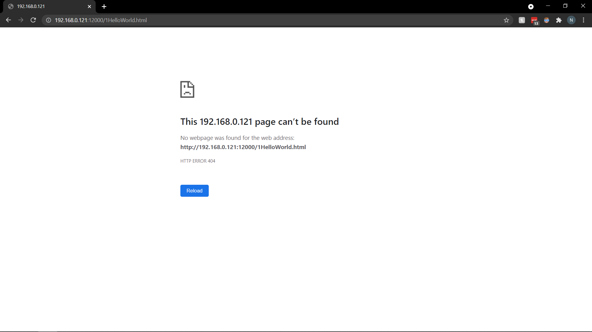
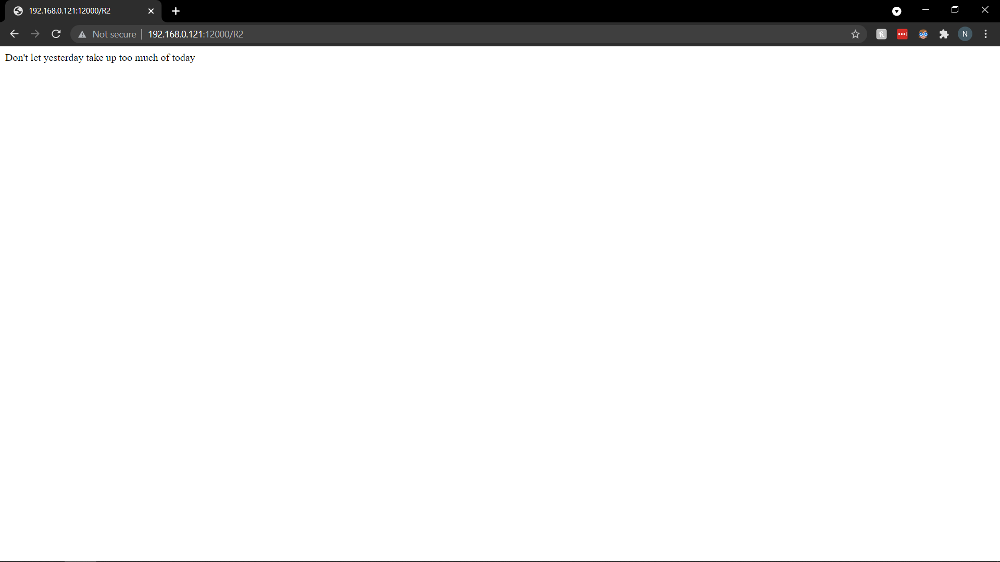
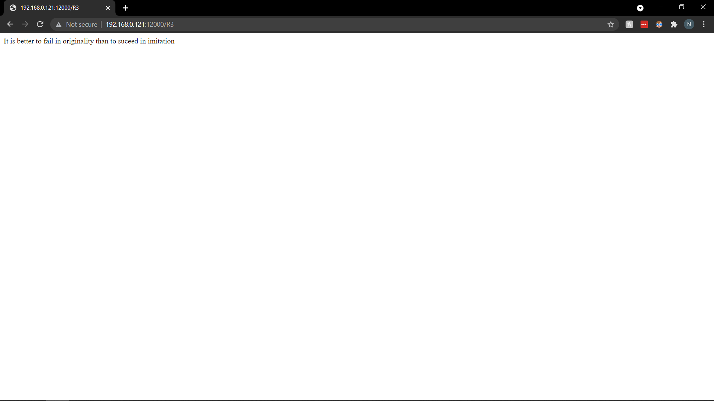
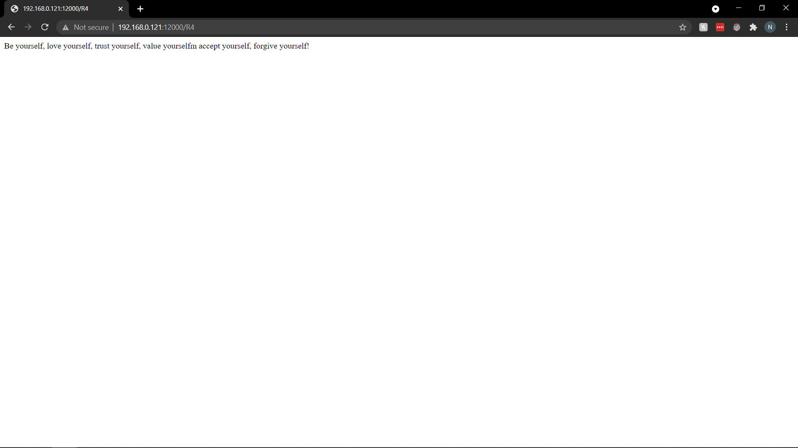

# Lab 4

Nick Boudreau\
CSC441\
Due: 9/22/2021

---

## Task  1: Simple HTTP Webserver using TCP

Through  the first part of this lab, a simple webserver is to be created so that another users is able to connect via a webpage with a request and get a respones from the server with a displayed message.
The given messages for this task were a "Hello World" when giving the HelloWorld.html file in the client response. Or a 404 Error message if the given file was incorrect.

Here is the completed response.


After that we have the 404 Error message response on failure. The failure state was the missspelled file.


<div style="page-break-after: always;"></div>

## Task 2: Add extra responses to the server

Now that the server is running. The task was to add several more message options based on the input given from the client as follows.

| Option | Description |
| ------ | ----------- |
| R1 | It is never too late to be what you might have been |
| R2 | Don't let yesterday take up too much of today |
| R3 | It is better to fail in originality than to succeed in imitation |
| R4 |  Be yourself, love yourself, trust yourself, value yourselfm accept yourself, forgive yourself! |

These response have all been confirmed as function via the server.






<div style="page-break-after: always;"></div>

### [Footnotes](https://github.com/markdown-it/markdown-it-footnote)

Footnote 1: Server Code

```python
#import socket module
from socket import *
import sys # In order to terminate the program

serverSocket = socket(AF_INET, SOCK_STREAM)

#Prepare a sever socket
serverPort = 12000
serverSocket.bind(('192.168.0.121', serverPort))
serverSocket.listen(1)

while True:
    #Establish the connection
    print('Ready to serve...')
    connectionSocket, addr = serverSocket.accept()
    
    try:
        message, clientAddress = connectionSocket.recvfrom(2048)
        message = message.decode()
        
        filename = message.split()[1]
        
        if(filename != "/HelloWorld.html"):
            filename = filename + ".html"
        
        f = open(filename[1:])
        outputdata = f.read()
        
        #Send one HTTP header line into socket
        connectionSocket.send('HTTP/1.1 200 OK\n\n'.encode())

        #Send the content of the requested file to the client
        for i in range(0, len(outputdata)):
            connectionSocket.send(outputdata[i].encode())
        connectionSocket.send("\r\n".encode())
        connectionSocket.close()
    except IOError:
        connectionSocket.send('HTTP/1.1 404 Not Found'.encode())
  
    connectionSocket.close()
        
serverSocket.close()
sys.exit()#Terminate the program after sending the corresponding data
```
